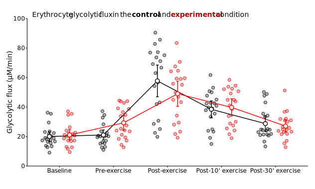
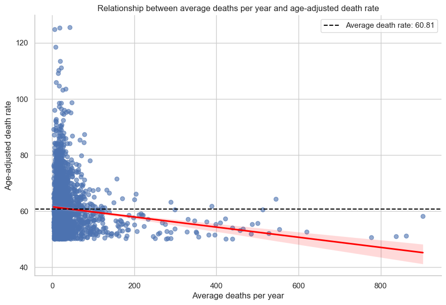
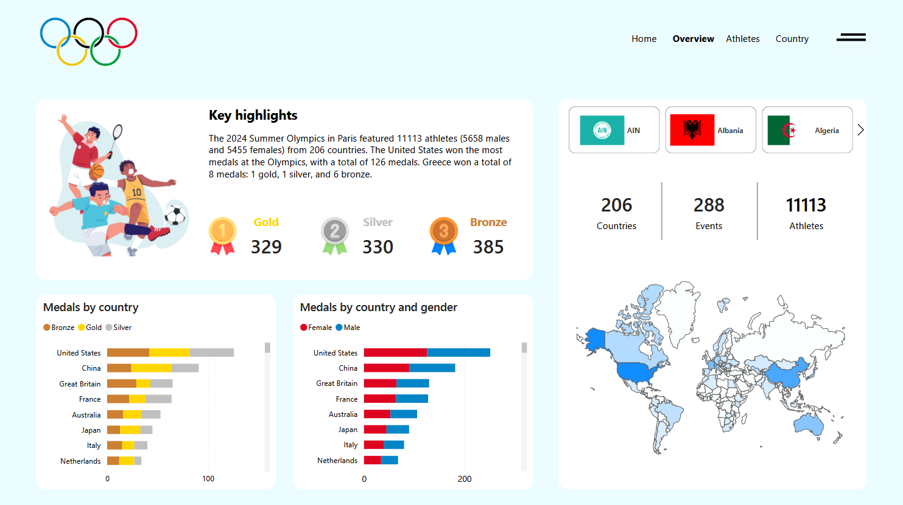
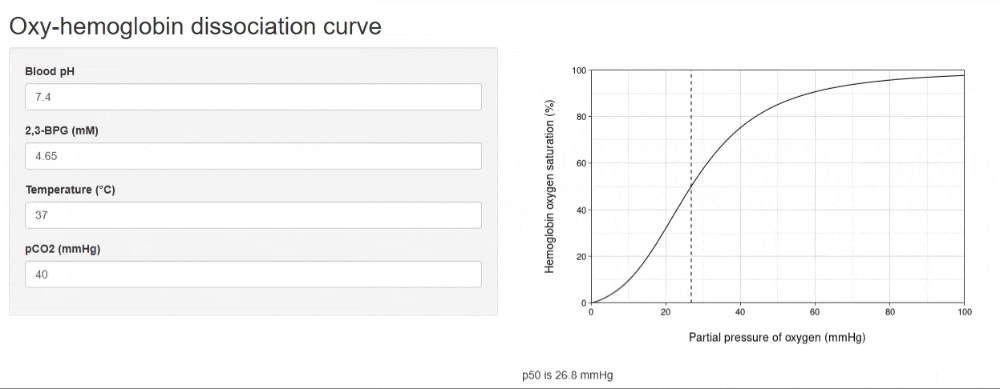

# Panagiotis Chatzinikolaou
I am a data-driven professional with experience in statistical programming, data analysis and visualization. I use tools like R, Python, SQL, and Power BI to uncover insights and drive decision-making. Passionate about continuous learning and transforming data into actionable solutions.

# Education
* PhD in Quantitative Exercise Physiology, *Aristotle University of Thessaloniki*, 2020-2024
* MSc in Human Performance and Health, *Aristotle University of Thessaloniki*, 2017-2019
* BSc in Sport Science, *National and Kapodistrian University of Athens*, 2010-2017

# Projects
## PhD Data Analysis and Statistics
This project accompanies our scientific paper from my PhD: "Erythrocyte glycolytic and redox metabolism affects muscle oxygenation and exercise performance: a randomized double-blind crossover study in humans". It features data preparation, visualization, and statistical analysis scripts. The analyses include custom scripts for linear models, repeated measures ANOVA, post-hoc tests, and effect size calculations. All code and datasets are available on the project's GitHub [repository](https://github.com/PanosChatzi/erythrocyte_study_statistical_analyses).

Programming languages and technologies: R, tidyverse, afex, lme4, emmeans, multcomp

## Healthcare and Bioinformatics Data Analysis
This portfolio features projects where I used Python and SQL to conduct exploratory data analysis on datasets from healthcare, bioinformatics, and finance. This work projects involved data cleaning, transformations, calculating statistical summaries, and creating visualizations to present key insights. Key projects include analyzing the impact of nutraceuticals on lifespan (DrugAge), cancer research trends, longevity gene variants, Covid testing patterns, and liquor store sales. The code and datasets can be found on the project's GitHub [repository](https://github.com/PanosChatzi/Healthcare_and_Bioinformatics_Analyses).

Programming languages and technologies: MySQL, Python, SciPy, pandas, seaborn, plotly

## Paris Olympics Dashboard
This project showcases a dynamic Power BI dashboard for the 2024 Paris Olympic Games. A Python script was used to download the dataset, via Kaggle's API, which was then loaded into Power BI. Data cleaning and transformation were performed within Power BI using Power Query and DAX. The dashboard includes interactive figures highlighting key metrics, such as total medals by country. The complete dashboard is available [here](https://github.com/PanosChatzi/paris_2024_olympics_dashboard).

Programming languages and technologies: Python, Power BI, DAX, Power Query

## Paris Olympics Database
This project involves creating a relational database in PostgreSQL using the 2024 Paris Olympics dataset within a Docker container in GitHub Codespaces. Data were downloaded from Kaggle as CSV files and imported into a PostgreSQL database. The database includes tables for athletes, medals, countries, events, and teams, enabling the tracking of athlete participation, medal distribution, and country performance. It supports CRUD operations, reporting on top-performing athletes and countries, and optimized queries using views and joins, providing a comprehensive system for analyzing Olympic data. The full code and datasets can be found [here](https://github.com/PanosChatzi/Paris_Olympics_2024_database/tree/main).

Programming languages and technologies: PostgreSQL, codespaces, docker, mermaid.js

## Fitness Data ETL Pipeline  
This project involved developing an ETL data pipeline to process fitness activity data from Strava and Intervals.icu using Python and SQL. Data was extracted from CSV files, and custom scripts were written to ensure data type quality and perform necessary transformations. Using SQLAlchemy, the data was then loaded into a relational database in SQL Server Management Studio (SSMS). The pipeline automated data ingestion and standardization to streamline storage and analysis. All code can be found [here](https://github.com/PanosChatzi/FitnessDatabase).

Programming languages and technologies: Python, Pandas, SQLAlchemy, pyodbc, T-SQL, SSMS

## Mathematical Modeling of Hemoglobin and ShinyApp Simulation
This project focused on developing a mathematical model of the hemoglobin oxygen dissociation curve in R. Then, an interactive Shiny web application was created to simulate and visualize the curve under various physiological conditions, as well as to facilitate effective communication of the model. The R model was published in a peer-reviewed scientific journal ([see publication here](https://onlinelibrary.wiley.com/doi/full/10.1111/apha.14081)). The code is available in the GitHub [repository](https://github.com/PanosChatzi/Erythrocyte-Metabolism), and you can explore the Shiny app [here](https://panoschatz.shinyapps.io/Oxyhemoglobin_dissociation_curve/).

Programming languages and technologies: R, Shiny, tidyverse, ggplot2

## Weather Web Application
This project involved building a responsive weather web application using the OpenWeather API. The backend was developed in Python with Flask, handling API requests and data processing, while the frontend was styled with CSS and HTML for a user-friendly interface. The application was deployed on Render for seamless access. The code is available in the GitHub [repository](https://github.com/PanosChatzi/python-weather), and you can try out the app [here](https://python-weather-103z.onrender.com/).

Programming languages and technologies: Python, Flask, requests, waitress, CSS, HTML

